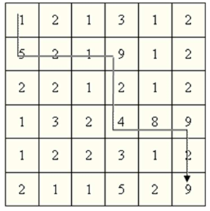

# Poszukiwania 

**Dostępna pamięć**: 32MB  

Książe Bratumił II Wstydliwy przez stosunek do białogłów swój przydomek otrzymał. Przeto 
jego rodziciel, król Rufin IV Rzadkowąsy, martwił się wielce. 40 lat Bratumiła dojrzałością 
późną na pewno zwać nie można, wszelako żona i dzieci dla syna chęcią przedłużenia rodu 
królewskiego nieodzowne Rufinowi wydawać się mogły. Toteż synowi nakazał, by królestwo 
całe przewędrował i za żonę jakową dorodną infantkę pojął. Syn wolę ojca spełnić zaprzysiągł, 
aliści warunek także wysunął: spędzi w podróży na poszukiwaniach księżniczki o dwa dni 
mniej, niż monarchia ojca hrabstw w szerokości i w długości w sumie liczy, a we wszelkim 
odwiedzonym hrabstwie dokładnie jeden dzionek pobędzie. Rufin tą przymusowością strapił 
się bardzo, azaliż synowi przyrzeczenie dał. Wszelako sam mu szlak zdeklarował się 
wyznaczyć taki, ażeby Bratumił na jak największą liczbę księżniczek okiem rzucił. 
Wtórą noc już Rufin oka zmrużyć nie może. Jak trasę wyznaczyć? Na szczęście informatyk 
z eskapady dalekiej akuratnie przybył i laptop najnowszej generacji z procesorem 
wielordzeniowym sprowadził. Tedy król pchnął umyślnego po nadwornego, by mu ową trasę 
ustalił. 

### Zadanie 
Mapa państwa to tablica kwadratowa o wymiarach n x n. Każdy kwadrat określa jedno 
hrabstwo, w każdej komórce znajduje się liczba zamieszkujących go księżniczek. 
Napisz program, który dla danej tablicy liczb n x n oblicza ścieżkę o maksymalnej liczbie 
księżniczek prowadzącą od lewego górnego pola tablicy do prawego dolnego. Ścieżka składa 
się z sekwencji kroków. Liczba kroków wynosi dokładnie 2 ⋅ n – 2. 
Maksymalną liczbą księżniczek ścieżki jest suma liczb w każdym z odwiedzonych pól tablicy. 
Maksymalna ścieżka w przykładowej tablicy o wymiarze 6 x 6 pokazana jest poniżej. 

### Wejście 
W pierwszym wierszu wejścia zapisana została jedna liczba całkowita n, oznaczającą liczbę 
wierszy oraz kolumn tablicy. Dalej następuje n x n liczb naturalnych nie większych niż 1000, 
w porządku wiersz-kolumna, tj. pierwszych n liczb tworzy pierwszy wiersz tablicy, następnych 
n liczb tworzy drugi wiersz itd. Liczby w wierszu są od siebie oddzielone przynajmniej jedną 
spacją. Liczba wierszy i kolumn jest z zakresu od 1 do 1000 włącznie. 

### Wyjście 
Pierwsza i jedyna liczba określa maksymalną liczbę księżniczek, jakie może poznać Bratumił.

### Przykład

| Wejście | Wyjście |
|---------|---------|
| 3 1 1 1 1 1 1 1 1 1  | 5|
|6 1 2 1 3 1 2 5 2 1 9 1 2 2 2 1 2 1 2 1 3 2 4 8 9 1 2 2 3 1 2 2 1 1 5 2 9 | 52 |